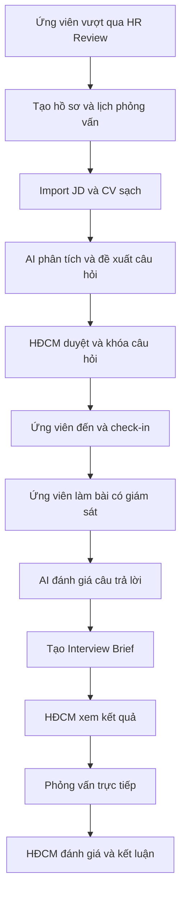
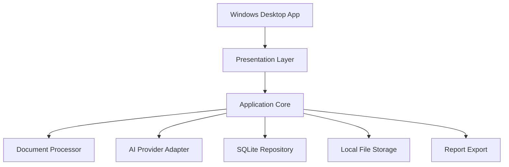

# 17. Phase 2 Supervised Interview Mini Tool — Context Specification

## 1. Mục tiêu tài liệu

Tài liệu này chốt context nghiệp vụ và kiến trúc mục tiêu cho mini tool hỗ trợ Hội đồng chuyên môn (HĐCM) trong vòng phỏng vấn ứng viên.

Mini tool được triển khai trực tiếp trên một máy tính Windows tại địa điểm phỏng vấn. Ứng viên làm bài trong điều kiện được kiểm soát trước khi HĐCM bắt đầu phần trao đổi trực tiếp. Hệ thống sử dụng AI để chuẩn bị câu hỏi, đánh giá sơ bộ câu trả lời và đề xuất nội dung cần phỏng vấn sâu.

Tài liệu là đầu vào cho các bước tiếp theo:

- Phân tích chi tiết use case.
- Thiết kế domain model và database.
- Thiết kế giao diện.
- Thiết kế AI prompt và output schema.
- Lập implementation task breakdown.
- Phát triển, kiểm thử và đóng gói ứng dụng Windows.

Tài liệu không phải source code và không thay thế tài liệu thiết kế kỹ thuật chi tiết.

---

## 2. Bối cảnh nghiệp vụ

### 2.1. Quy trình phỏng vấn hiện tại

Quy trình hiện tại gồm:

1. Ứng viên tham gia phỏng vấn.
2. HĐCM tạo bộ câu hỏi.
3. Ứng viên trả lời tại phòng phỏng vấn.
4. HĐCM thu thập câu trả lời.
5. HĐCM đánh giá câu trả lời.
6. HĐCM bắt đầu phỏng vấn trực tiếp.

Các hạn chế chính:

- HĐCM phải đọc JD, CV và tự chuẩn bị câu hỏi.
- Việc thu thập, tổng hợp câu trả lời còn thủ công.
- HĐCM phải đánh giá lại toàn bộ câu trả lời trước khi hỏi sâu.
- Câu hỏi trực tiếp có thể trùng với thông tin đã có trong CV hoặc bài viết.
- Thời gian phỏng vấn kéo dài do chưa xác định trước nội dung nào đã rõ và nội dung nào cần xác minh.

### 2.2. Quy trình mục tiêu

Quy trình mục tiêu được chốt:

> HĐCM chuẩn bị và duyệt câu hỏi trước. Ứng viên đến địa điểm phỏng vấn sớm, làm bài trên mini tool trong điều kiện được kiểm soát nhưng không cần HĐCM ngồi chờ. AI đánh giá câu trả lời và tạo Interview Brief. Sau đó HĐCM bắt đầu phần phỏng vấn trực tiếp, tập trung vào những năng lực quan trọng, điểm còn thiếu bằng chứng hoặc điểm mâu thuẫn.

### 2.3. Mục tiêu tối ưu

- Giảm thời gian HĐCM chuẩn bị trước phỏng vấn.
- Giảm thời gian HĐCM trực tiếp tham gia cho mỗi ứng viên.
- Chuẩn hóa tiêu chí và cách đánh giá giữa các ứng viên.
- Cá nhân hóa một phần câu hỏi theo JD và CV.
- Tự động thu thập, lưu và tổng hợp câu trả lời.
- Cung cấp bằng chứng để HĐCM hỏi sâu có trọng tâm.
- Không thay thế quyền quyết định của HĐCM.

---

## 3. Nguyên tắc chốt

| STT | Nguyên tắc | Nội dung chốt |
| --- | --- | --- |
| 1 | HĐCM quyết định cuối | AI chỉ hỗ trợ, không tự động tuyển hoặc loại ứng viên. |
| 2 | Câu hỏi được duyệt trước | AI tạo bản nháp; HĐCM sửa, duyệt và khóa trước khi ứng viên làm bài. |
| 3 | Ứng viên làm bài tại chỗ | Bài làm được thực hiện tại địa điểm phỏng vấn trong điều kiện kiểm soát. |
| 4 | HĐCM không cần ngồi chờ | Ứng viên đến sớm và làm bài trước thời điểm HĐCM bắt đầu trao đổi trực tiếp. |
| 5 | Một máy Windows | MVP ưu tiên ứng viên và HĐCM sử dụng tuần tự trên cùng một máy. |
| 6 | Local-first | Dữ liệu nghiệp vụ và tài liệu được lưu cục bộ trên máy client. |
| 7 | Không cần server | MVP không triển khai web server, database server hoặc hạ tầng tập trung. |
| 8 | AI có fallback | Khi AI lỗi, HĐCM vẫn xem được câu trả lời gốc và tiếp tục đánh giá thủ công. |
| 9 | Câu hỏi có bằng chứng | Mỗi câu hỏi cần gắn với năng lực, mục đích, rubric và bằng chứng mong đợi. |
| 10 | Không hỏi lại nội dung đã rõ | Phỏng vấn trực tiếp tập trung vào gap, mâu thuẫn và năng lực bắt buộc chưa được xác minh. |
| 11 | Snapshot và version | JD, CV text, bộ câu hỏi, prompt và kết quả AI phải truy vết được phiên bản. |
| 12 | CV sạch | Khi lấy dữ liệu từ Recruitment Core, chỉ sử dụng CV sạch, không dùng CV gốc trong quarantine. |

---

## 4. Phạm vi

### 4.1. Trong phạm vi MVP

- Tạo hồ sơ/phần việc phỏng vấn cho một ứng viên.
- Import JD và CV.
- Trích xuất text từ PDF, DOCX, TXT hoặc Markdown.
- Phân tích JD và CV bằng AI.
- Xây dựng ma trận năng lực sơ bộ.
- AI đề xuất bộ câu hỏi.
- HĐCM duyệt, chỉnh sửa, sắp xếp và khóa câu hỏi.
- Chuyển ứng dụng sang Candidate Mode.
- Ứng viên làm bài có giới hạn thời gian.
- Tự động lưu câu trả lời.
- Submit hoặc tự submit khi hết thời gian theo cấu hình.
- AI đánh giá câu trả lời.
- Tạo Interview Brief.
- Đề xuất câu hỏi trực tiếp.
- HĐCM nhập ghi chú, điểm và trạng thái bằng chứng.
- HĐCM chốt kết quả.
- Xuất báo cáo và gói dữ liệu backup.
- Ghi audit cho các thao tác quan trọng.

### 4.2. Ngoài phạm vi MVP

- Đăng tin tuyển dụng và thu CV đa kênh.
- HR pre-screening của Phase 1.
- Xếp lịch tự động.
- Email hoặc notification platform.
- Đồng bộ hai chiều với AMIS.
- Nhiều máy truy cập đồng thời.
- Hệ thống tài khoản doanh nghiệp tập trung.
- Camera proctoring hoặc nhận diện khuôn mặt.
- Phân tích cảm xúc, ngoại hình hoặc giọng nói.
- Ghi âm, speech-to-text và phân tích realtime cuộc hội thoại.
- AI tự quyết định `PASS` hoặc `FAIL`.
- Coding judge đa ngôn ngữ.
- Vector database, RAG hoặc knowledge platform phức tạp.
- Local LLM đóng gói bắt buộc cùng bộ cài.

---

## 5. Ranh giới với Recruitment Phase 1

| Nội dung | Phase 1 Pre-screening | Phase 2 Supervised Interview Assessment |
| --- | --- | --- |
| Thời điểm | Trước HR Review | Sau HR Review, sát thời điểm phỏng vấn chuyên môn |
| Địa điểm | Có thể làm từ xa | Làm tại địa điểm phỏng vấn |
| Mục đích | Hỗ trợ HR sàng lọc | Hỗ trợ HĐCM đánh giá chuyên môn |
| Điều kiện | Public form token | Candidate Mode trên máy được kiểm soát |
| Nội dung | Điều kiện cơ bản và thông tin bổ sung | Chuyên môn, tình huống, xác minh kinh nghiệm |
| Kết quả | Input cho AI Screening và HR Review | Input cho Interview Brief và phỏng vấn trực tiếp |
| Người quyết định | HR trong phạm vi Phase 1 | HĐCM trong vòng phỏng vấn |

Không tái sử dụng trực tiếp `FormSession` của Phase 1 làm phiên đánh giá chuyên môn. Có thể import dữ liệu Phase 1 dưới dạng input snapshot nhưng phải tạo một interview assessment riêng.

---

## 6. Actor và trách nhiệm

| Actor | Trách nhiệm |
| --- | --- |
| HR/Điều phối viên | Tạo hồ sơ, nhập lịch, check-in, hướng dẫn ứng viên và xử lý tình huống vận hành. |
| HĐCM | Duyệt câu hỏi, xem Interview Brief, phỏng vấn trực tiếp, chấm và chốt kết quả. |
| Ứng viên | Làm bài đúng thời gian, submit và tham gia phỏng vấn trực tiếp. |
| AI | Phân tích input, đề xuất câu hỏi, đánh giá sơ bộ và gợi ý follow-up. |
| Mini tool | Điều phối state, lưu dữ liệu, kiểm soát Candidate Mode, audit và xuất báo cáo. |
| Quản trị cấu hình | Cấu hình AI endpoint, prompt, thời gian mặc định, chính sách dữ liệu và PIN HĐCM. |

---

## 7. Flow nghiệp vụ tổng thể



---

## 8. Flow chi tiết

### 8.1. Tạo Interview Case

Điều kiện:

- Ứng viên được đưa vào vòng phỏng vấn chuyên môn.
- Có thông tin vị trí và target level.
- Có JD và CV hợp lệ.

Thông tin cần nhập:

- Mã ứng viên.
- Họ tên ứng viên.
- Vị trí tuyển dụng.
- Target level.
- Lịch phỏng vấn.
- Thành viên HĐCM nếu cần.
- Thời gian làm bài.
- Chính sách sử dụng tài liệu, Internet hoặc công cụ hỗ trợ.

Kết quả:

- Tạo `InterviewCase` ở trạng thái `DRAFT`.
- Tạo vùng lưu tài liệu riêng theo case ID.

### 8.2. Import và xử lý tài liệu

Input:

- JD: PDF, DOCX, TXT hoặc Markdown.
- CV: ưu tiên CV sạch; chấp nhận PDF hoặc DOCX trong MVP.

Rule:

- Tính hash file.
- Lưu bản snapshot.
- Trích xuất text.
- Không dùng file có macro hoặc định dạng không hỗ trợ.
- Không gửi file gốc sang AI; chỉ gửi text đã làm sạch và dữ liệu cần thiết.
- Cho HĐCM xem và xác nhận nội dung extract trước khi sinh câu hỏi.

Kết quả:

- `DocumentSnapshot` cho JD.
- `DocumentSnapshot` cho CV.
- Case đủ điều kiện chạy AI question generation.

### 8.3. AI phân tích và sinh câu hỏi

AI cần tạo:

- Ma trận năng lực theo JD.
- Năng lực bắt buộc.
- Năng lực ưu tiên.
- Bằng chứng đã thấy trong CV.
- Khoảng thiếu thông tin.
- Điểm mâu thuẫn hoặc chưa rõ.
- Bộ câu hỏi đề xuất.
- Rubric và bằng chứng mong đợi cho từng câu.

Nguyên tắc bộ câu hỏi:

- Tối đa 5–8 câu trong MVP.
- Thời gian làm bài khuyến nghị 10–15 phút.
- Có câu hỏi chuẩn hóa theo vị trí/level để so sánh ứng viên.
- Có câu hỏi cá nhân hóa theo CV, gap hoặc mâu thuẫn.
- Không hỏi lại những dữ liệu đơn giản đã có đầy đủ trong CV.
- Không sử dụng tiêu chí nhạy cảm không liên quan đến công việc.

Cơ cấu mặc định đề xuất:

| Nhóm | Số lượng đề xuất |
| --- | ---: |
| Năng lực bắt buộc theo JD | 2 |
| Tình huống chuyên môn | 1–2 |
| Xác minh kinh nghiệm CV | 1 |
| Gap hoặc mâu thuẫn | 1 |

### 8.4. HĐCM duyệt câu hỏi

HĐCM được phép:

- Giữ nguyên câu hỏi.
- Sửa nội dung.
- Thay đổi thứ tự.
- Thêm/xóa câu hỏi.
- Chọn câu từ Question Bank.
- Sửa độ khó, thời gian và rubric.
- Yêu cầu AI sinh lại một phần.

Khi HĐCM xác nhận:

- Tạo version/snapshot bất biến của bộ câu hỏi.
- Chuyển trạng thái sang `QUESTIONS_APPROVED`.
- Không cho chỉnh âm thầm sau khi ứng viên bắt đầu.
- Nếu bắt buộc thay đổi, phải tạo version mới và ghi audit.

### 8.5. Check-in và Candidate Mode

Ứng viên nên đến trước lịch gặp HĐCM khoảng 15–20 phút.

Điều phối viên/HĐCM:

- Xác nhận danh tính.
- Mở đúng Interview Case.
- Kiểm tra bộ câu hỏi đã duyệt.
- Chọn `Bắt đầu bài làm`.
- Nhập PIN để chuyển ứng dụng sang Candidate Mode.

Candidate Mode:

- Chỉ hiển thị thông tin cần thiết.
- Không có menu quản trị.
- Không hiển thị rubric, đáp án hoặc nhận xét.
- Có bộ đếm thời gian.
- Tự động lưu câu trả lời.
- Sau submit chỉ hiển thị màn hình hoàn thành.
- Muốn trở lại Committee Mode phải nhập PIN.

### 8.6. Ứng viên làm bài

Rule:

- Mỗi case có tối đa một attempt active.
- Câu trả lời có thể sửa cho đến khi submit nếu policy cho phép.
- Sau submit không được sửa.
- Khi hết thời gian, hệ thống tự submit hoặc khóa bài theo cấu hình.
- Câu chưa trả lời phải được đánh dấu rõ.
- Không hiển thị kết quả AI cho ứng viên.
- Các event như rời cửa sổ hoặc copy chỉ là tín hiệu tham khảo, không tự động loại.

Trạng thái:

```text
READY_FOR_ASSESSMENT
→ ASSESSMENT_IN_PROGRESS
→ ASSESSMENT_SUBMITTED
```

### 8.7. AI đánh giá câu trả lời

AI đánh giá theo từng câu và từng năng lực.

Các chiều đánh giá:

- Mức độ đúng trọng tâm.
- Mức độ chính xác.
- Độ sâu.
- Bằng chứng thực tế.
- Mức độ làm chủ công việc.
- Khả năng lập luận.
- Tính nhất quán với CV.
- Mức độ đầy đủ.

Thang điểm khuyến nghị:

| Điểm | Ý nghĩa |
| ---: | --- |
| 0 | Không trả lời hoặc hoàn toàn sai |
| 1 | Rất yếu, không có bằng chứng |
| 2 | Có hiểu biết cơ bản nhưng chưa đủ |
| 3 | Đáp ứng yêu cầu |
| 4 | Đáp ứng tốt, có bằng chứng và lập luận rõ |

Trạng thái bằng chứng:

- `VERIFIED`.
- `PARTIALLY_VERIFIED`.
- `UNVERIFIED`.
- `CONFLICTING`.
- `NOT_MET`.
- `NOT_ASSESSED`.

AI không được tự chuyển case sang `FAIL`.

### 8.8. Tạo Interview Brief

Interview Brief phải đọc được trong 3–5 phút và gồm:

1. Thông tin tóm tắt ứng viên, vị trí và level.
2. Thời gian và mức độ hoàn thành bài.
3. Điểm mạnh có bằng chứng.
4. Năng lực chưa đủ bằng chứng.
5. Điểm mâu thuẫn giữa CV và câu trả lời.
6. Ma trận năng lực.
7. Ba câu hỏi trực tiếp bắt buộc.
8. Tối đa hai câu hỏi bổ sung.
9. Dấu hiệu câu trả lời tốt/yếu.
10. Confidence và giới hạn của đánh giá AI.

### 8.9. Phỏng vấn trực tiếp

HĐCM thực hiện:

- Xác minh tính xác thực của bài viết.
- Làm rõ gap và mâu thuẫn.
- Đưa tình huống mới để kiểm tra khả năng vận dụng.
- Đánh giá giao tiếp, tư duy và phản xạ.
- Ghi chú, điểm và trạng thái bằng chứng.
- Đánh dấu câu hỏi đã hỏi/bỏ qua.
- Yêu cầu AI gợi ý follow-up từ ghi chú khi cần.

Nếu câu trả lời trực tiếp mâu thuẫn với bài viết:

- Tạo flag `PRE_ASSESSMENT_AND_LIVE_ANSWER_CONFLICT`.
- HĐCM ghi nhận lý do.
- Đánh giá trực tiếp của HĐCM có mức ưu tiên cao hơn nhận định AI từ bài viết.

Điều kiện dừng:

- Các năng lực bắt buộc đã đủ bằng chứng.
- Đã làm rõ mâu thuẫn quan trọng.
- Không còn câu hỏi ưu tiên cao.
- Ứng viên không đáp ứng tiêu chí bắt buộc và HĐCM đã có đủ bằng chứng.
- Đạt giới hạn thời gian.
- HĐCM quyết định chuyển sang vòng chuyên sâu khác.

### 8.10. Kết luận

HĐCM đánh giá:

- Năng lực chuyên môn.
- Khả năng giải quyết vấn đề.
- Kinh nghiệm thực tế.
- Mức độ phù hợp level.
- Giao tiếp và phối hợp.
- Điểm mạnh, điểm yếu và rủi ro.
- Nhu cầu đào tạo nếu tuyển.

Kết quả:

- `PASS`.
- `FAIL`.
- `NEXT_ROUND`.
- `NEEDS_ADDITIONAL_ASSESSMENT`.
- `PENDING`.

AI có thể tạo summary, nhưng HĐCM phải xác nhận và chốt kết quả.

---

## 9. State machine

```text
DRAFT
→ DOCUMENTS_READY
→ QUESTIONS_GENERATING
→ QUESTIONS_GENERATED
→ QUESTIONS_APPROVED
→ READY_FOR_ASSESSMENT
→ ASSESSMENT_IN_PROGRESS
→ ASSESSMENT_SUBMITTED
→ AI_ANALYZING
→ INTERVIEW_BRIEF_READY
→ LIVE_INTERVIEW_IN_PROGRESS
→ LIVE_INTERVIEW_COMPLETED
→ EVALUATION_PENDING
→ EVALUATED
```

Trạng thái ngoại lệ:

```text
DOCUMENT_PARSE_FAILED
QUESTION_GENERATION_FAILED
ASSESSMENT_INTERRUPTED
ASSESSMENT_EXPIRED
AI_ANALYSIS_FAILED
CANDIDATE_NO_SHOW
CANCELLED
```

Rule chuyển trạng thái:

- Không sinh câu hỏi khi thiếu JD hoặc CV text.
- Không bắt đầu assessment nếu câu hỏi chưa được duyệt.
- Không sửa snapshot câu hỏi khi assessment đã bắt đầu.
- Không sửa answer sau submit.
- AI fail cho phép chuyển sang manual review, không làm mất answer.
- Chỉ HĐCM được chốt `EVALUATED`.
- Nếu sửa kết quả đã chốt, phải lưu version mới hoặc audit đầy đủ.

---

## 10. Kiến trúc mục tiêu

### 10.1. Kiểu kiến trúc

Chốt kiến trúc MVP:

> Windows Desktop Local-First Modular Monolith, một process, không có server cục bộ, sử dụng SQLite và local filesystem.

### 10.2. Công nghệ đề xuất

| Thành phần | Đề xuất |
| --- | --- |
| Loại ứng dụng | Windows Desktop Application |
| Ngôn ngữ | C# |
| UI | WPF |
| Kiến trúc source | Modular monolith theo Domain/Application/Infrastructure/Presentation |
| Database | SQLite |
| ORM | EF Core SQLite |
| File storage | Local filesystem |
| AI | AI Provider Adapter qua HTTPS hoặc internal endpoint |
| Bảo vệ secret | Windows Data Protection |
| Đóng gói | Self-contained Windows installer |

### 10.3. Sơ đồ kiến trúc



### 10.4. Lý do không dùng backend riêng

MVP chỉ có một máy và người dùng sử dụng tuần tự. Không có yêu cầu truy cập đồng thời, API public hoặc đồng bộ realtime. Vì vậy không mở HTTP server và không tách frontend/backend, nhằm giảm:

- Thành phần phải cài đặt.
- Cấu hình mạng và firewall.
- Rủi ro bảo mật.
- Khả năng lỗi khi khởi động.
- Chi phí vận hành.

### 10.5. Module ứng dụng

- `InterviewCases`.
- `DocumentProcessing`.
- `QuestionPreparation`.
- `CandidateAssessment`.
- `AiEvaluation`.
- `InterviewBriefs`.
- `LiveInterviews`.
- `FinalEvaluations`.
- `AuditLogs`.
- `Configuration`.
- `BackupExport`.

---

## 11. Domain model tối thiểu

### 11.1. InterviewCase

Trung tâm nghiệp vụ, gồm candidate, position, target level, schedule, status và liên kết đến toàn bộ dữ liệu phỏng vấn.

### 11.2. DocumentSnapshot

Lưu metadata, hash, local path, extracted text, loại tài liệu và thời điểm snapshot.

### 11.3. QuestionSet

Lưu version, status, thời gian làm bài, người duyệt và danh sách câu hỏi snapshot.

### 11.4. AssessmentQuestion

Gồm text, competency, source, purpose, type, difficulty, expected evidence, rubric, required và order.

### 11.5. AssessmentAttempt

Lưu trạng thái attempt, thời gian bắt đầu, hết hạn, submit và event vận hành.

### 11.6. AssessmentAnswer

Lưu câu trả lời theo attempt và question snapshot.

### 11.7. AiAssessmentResult

Lưu đánh giá theo câu, theo năng lực, confidence, model, prompt version, schema version và lỗi nếu có.

### 11.8. InterviewBrief

Lưu summary, competency matrix, strengths, gaps, conflicts và recommended live questions.

### 11.9. LiveInterviewRecord

Lưu câu hỏi đã hỏi, ghi chú, điểm, trạng thái bằng chứng và follow-up.

### 11.10. FinalEvaluation

Lưu kết quả cuối, final level, nhận xét và người chốt.

### 11.11. AuditLog

Lưu actor, action, entity, timestamp và metadata đã loại bỏ dữ liệu nhạy cảm không cần thiết.

---

## 12. AI contract

### 12.1. AI capability

AI Provider Adapter cung cấp các capability:

```text
GenerateQuestionSet
EvaluateAssessment
GenerateInterviewBrief
SuggestFollowUpQuestions
```

### 12.2. AI Call 1 — Question generation

Input:

- JD snapshot text.
- CV snapshot text đã làm sạch.
- Position.
- Target level.
- Thời gian làm bài.
- Question policy.
- Question Bank context nếu có.

Output bắt buộc:

- Competency matrix.
- CV evidence.
- Gaps.
- Conflicts.
- Proposed questions.
- Expected evidence.
- Rubric.
- Estimated time.
- Output schema version.

### 12.3. AI Call 2 — Assessment evaluation

Input:

- JD snapshot.
- CV snapshot.
- Question set snapshot.
- Answers.
- Rubric.

Output bắt buộc:

- Per-answer score và reasoning.
- Per-competency evidence status.
- Strengths.
- Gaps.
- Conflicts.
- Risks.
- Recommended live questions.
- Interview Brief summary.
- Confidence.
- Schema version.

### 12.4. AI Call 3 — Optional follow-up

Input:

- Interview Brief.
- Câu hỏi vừa hỏi.
- Ghi chú/câu trả lời tóm tắt của HĐCM.
- Remaining competencies.

Output:

- Tối đa 1–3 câu hỏi follow-up.
- Lý do hỏi.
- Bằng chứng cần tìm.
- Điều kiện dừng.

### 12.5. AI validation

- Output phải là JSON hợp lệ theo schema.
- Score ngoài range là invalid.
- Enum ngoài danh sách là invalid.
- Thiếu field bắt buộc là invalid.
- Retry tối đa một lần với lỗi provider/schema.
- Nếu vẫn lỗi, lưu `AI_ANALYSIS_FAILED` và cho phép manual fallback.
- Không lưu đè kết quả cũ khi rerun; tạo version mới.

---

## 13. Security và privacy

### 13.1. Local security

- Ứng dụng không mở cổng HTTP trong MVP.
- Dữ liệu nằm trong thư mục của Windows user hiện tại.
- Hạn chế quyền truy cập bằng NTFS.
- Khuyến nghị máy bật mã hóa ổ đĩa.
- Committee Mode được bảo vệ bằng PIN/mật khẩu.
- Mật khẩu lưu dạng hash.
- AI API key được bảo vệ bằng cơ chế secret protection của Windows.

### 13.2. Candidate Mode

- Không hiển thị menu quản trị.
- Không expose CV, JD nội bộ, rubric hoặc AI result.
- Thoát Candidate Mode cần PIN.
- Sau submit không cho quay lại answer form.
- Fullscreen/chặn phím chỉ là biện pháp hỗ trợ, không thay thế giám sát vật lý.

### 13.3. AI data policy

- Không gửi file gốc sang AI.
- Không gửi email, SĐT, địa chỉ hoặc ảnh nếu không cần thiết.
- Dùng candidate code thay cho tên khi có thể.
- Chỉ gửi nội dung cần cho nghiệp vụ.
- Lưu provider, model và prompt version để audit.
- Nếu dữ liệu không được phép ra ngoài, adapter phải gọi AI Gateway nội bộ hoặc local AI.

### 13.4. Untrusted content

CV, JD và câu trả lời được coi là dữ liệu không tin cậy.

- Không thực thi script hoặc macro.
- Không làm theo instruction nằm trong CV/câu trả lời.
- Prompt phải phân tách system instruction với document content.
- Validate toàn bộ AI output trước khi sử dụng.

### 13.5. Audit bắt buộc

- Import tài liệu.
- Sinh câu hỏi.
- Duyệt/khóa câu hỏi.
- Bắt đầu/kết thúc assessment.
- Auto-submit/time-expired.
- AI run/rerun/fail.
- Chuyển Candidate/Committee Mode.
- Chốt hoặc sửa kết quả cuối.
- Export, backup và xóa hồ sơ.

---

## 14. Lưu trữ cục bộ

```text
%LOCALAPPDATA%\VCSInterviewAssistant\
├── database\
│   └── interview.db
├── documents\
│   └── {interview-case-id}\
│       ├── jd\
│       └── cv\
├── exports\
├── backups\
├── logs\
└── config\
```

Rule:

- Không đặt dữ liệu trong thư mục cài đặt.
- Không dùng tên ứng viên làm directory key; dùng case ID/UUID.
- Không ghi secret hoặc raw token vào log.
- Có chính sách retention và thao tác xóa hồ sơ.
- Backup mang ra ngoài phải được bảo vệ theo chính sách đơn vị.

---

## 15. UI scope tối thiểu

### 15.1. Danh sách Interview Case

- Tạo mới.
- Tìm kiếm.
- Lọc trạng thái.
- Mở case.
- Backup/xóa theo quyền.

### 15.2. Import JD và CV

- Chọn file.
- Xem trạng thái parse.
- Xem extracted text.
- Xác nhận snapshot.

### 15.3. Question Preparation

- Generate bằng AI.
- Sửa/thêm/xóa/sắp xếp.
- Xem competency, purpose và rubric.
- Approve/lock.

### 15.4. Check-in

- Xác nhận candidate.
- Hiển thị thời gian và policy.
- Bắt đầu Candidate Mode.

### 15.5. Candidate Assessment

- Hướng dẫn.
- Câu hỏi.
- Bộ đếm thời gian.
- Auto-save.
- Submit.
- Trang hoàn thành.

### 15.6. Interview Brief và Live Interview

- Ma trận năng lực.
- Answer và AI analysis.
- Strength/gap/conflict.
- Recommended question.
- Ghi chú, điểm và evidence status.

### 15.7. Final Evaluation

- Kết quả.
- Final level.
- Nhận xét.
- Xác nhận HĐCM.
- Xuất báo cáo.

---

## 16. Error và fallback

| Tình huống | Xử lý |
| --- | --- |
| JD/CV parse fail | Cho phép nhập/paste text thủ công hoặc thay file. |
| AI question generation fail | Retry một lần hoặc HĐCM tạo câu hỏi thủ công. |
| Ứng viên đến muộn | Áp dụng policy rút ngắn, chuyển lịch hoặc hủy. |
| Candidate no-show | Chuyển `CANDIDATE_NO_SHOW`. |
| Mất điện/app crash | Khôi phục draft answer từ local database khi có thể. |
| Hết thời gian | Auto-submit hoặc khóa theo policy. |
| AI evaluation fail | HĐCM xem answer gốc và đánh giá thủ công. |
| API key/endpoint lỗi | Báo cấu hình, không làm mất hồ sơ/bài làm. |
| HĐCM quên PIN | Quy trình reset cục bộ có kiểm soát; không để candidate tự reset. |
| Cần sửa câu hỏi đã khóa | Tạo version mới nếu assessment chưa bắt đầu; nếu đã bắt đầu thì không thay đổi attempt hiện tại. |
| Kết quả đã chốt cần sửa | Tạo revision/audit reason, không overwrite im lặng. |

---

## 17. Non-functional requirements

### 17.1. Triển khai

- Bộ cài self-contained trên Windows.
- Máy client không cần cài database, Node.js, Python hoặc Docker.
- Tự tạo SQLite database và chạy migration khi khởi động.
- Có thể cài theo user nếu chính sách cho phép.

### 17.2. Hiệu năng

- Mở ứng dụng và load case không phụ thuộc AI.
- Auto-save không làm gián đoạn thao tác nhập.
- AI xử lý bất đồng bộ và có trạng thái tiến độ.
- Mục tiêu tạo Interview Brief trong khoảng 1–2 phút sau submit, phụ thuộc provider.

### 17.3. Độ tin cậy

- Không mất answer khi AI lỗi.
- Không mất answer do đóng cửa sổ thông thường.
- Có backup/export.
- Migration database phải có version.

### 17.4. Khả dụng

- Candidate UI đơn giản, toàn màn hình và dễ đọc.
- Committee UI ưu tiên thông tin cần hành động.
- Interview Brief đọc được trong 3–5 phút.
- Không bắt HĐCM đọc raw AI output dài.

### 17.5. Maintainability

- Tách Domain, Application, Infrastructure và Presentation trong source.
- AI provider, document parser và report exporter nằm sau interface.
- Prompt và schema có version.
- Business rule không hardcode trong UI.

---

## 18. KPI pilot

| KPI | Mục tiêu/ý nghĩa |
| --- | --- |
| Thời gian HĐCM chuẩn bị | Mục tiêu không quá 5 phút/case sau khi có câu hỏi AI |
| Thời gian ứng viên làm bài | Khoảng 10–15 phút |
| Thời gian tạo Interview Brief | Mục tiêu 1–2 phút sau submit |
| Thời gian phỏng vấn trực tiếp | Mục tiêu khoảng 25–35 phút |
| Số câu hỏi trực tiếp ưu tiên | 3–5 câu |
| Tỷ lệ câu hỏi AI được sử dụng | Theo dõi chất lượng question generation |
| Tỷ lệ HĐCM override AI | Theo dõi để cải tiến, không coi override là lỗi |
| Tỷ lệ AI/manual fallback | Đánh giá độ ổn định |
| Tỷ lệ phiên hoàn tất đúng lịch | Đánh giá hiệu quả vận hành |
| Mức hài lòng của HĐCM | Thu thập sau pilot |

---

## 19. Acceptance criteria cấp cao

MVP được xem là đáp ứng khi:

1. Cài được bằng một bộ cài trên máy Windows mà không cần cài database hoặc runtime riêng.
2. Tạo được Interview Case và import JD/CV.
3. Extract được text hoặc cho phép nhập text fallback.
4. AI sinh được bộ câu hỏi có schema hợp lệ.
5. HĐCM sửa, duyệt và khóa được bộ câu hỏi.
6. Ứng viên làm bài trong Candidate Mode, có timer và auto-save.
7. Answer được lưu an toàn khi submit.
8. AI tạo được per-answer evaluation và Interview Brief.
9. HĐCM xem được answer gốc khi AI fail.
10. HĐCM ghi nhận phỏng vấn trực tiếp và chốt kết quả.
11. AI không có khả năng tự động chốt `FAIL`.
12. Có audit cho các hành động quan trọng.
13. Xuất được báo cáo và backup.
14. Không mở server/cổng mạng ngoài kết nối outbound tới AI endpoint được cấu hình.

---

## 20. Implementation constraints

- Không mở rộng MVP thành hệ thống tuyển dụng tổng thể.
- Không phụ thuộc vào Phase 1 để chạy; import thủ công phải hoạt động độc lập.
- Không nhúng AI provider trực tiếp vào domain logic.
- Không lưu API key plain text.
- Không lưu raw CV hoặc answer trong log.
- Không cho candidate truy cập Committee Workspace.
- Không dùng điểm AI làm căn cứ duy nhất để loại ứng viên.
- Không bỏ qua manual fallback.
- Không đưa local LLM vào bộ cài mặc định trong MVP.

---

## 21. Extension points sau MVP

- Import Interview Package từ Recruitment Core.
- Export Evaluation Package về Recruitment Core hoặc AMIS.
- Question Bank tập trung.
- Đồng bộ nhiều máy.
- Server mode trong mạng nội bộ.
- Tài khoản và phân quyền doanh nghiệp.
- AI Gateway nội bộ.
- Local AI tùy chọn.
- Coding assessment riêng.
- Lịch phỏng vấn và phòng họp.
- Dashboard KPI và chất lượng tuyển dụng.
- Speech-to-text nếu có chính sách và sự đồng ý phù hợp.

Các extension này không làm thay đổi nguyên tắc: AI hỗ trợ, HĐCM quyết định.

---

## 22. Assumption và điểm cần chốt ở specification tiếp theo

| Chủ đề | Assumption hiện tại | Cần chốt tiếp |
| --- | --- | --- |
| Thiết bị | Ứng viên và HĐCM dùng tuần tự cùng một máy | Có cần máy riêng cho candidate không |
| AI | Có endpoint AI được đơn vị phê duyệt | Provider, model, quota và data policy |
| PIN | Một PIN HĐCM cục bộ | Có cần nhiều tài khoản không |
| Thời gian | Mặc định 15 phút | Cấu hình theo vị trí/level |
| Question mix | Có câu chuẩn hóa và cá nhân hóa | Tỷ lệ cụ thể theo vị trí |
| Internet | Chỉ cần khi gọi AI endpoint | Chính sách offline hoặc proxy |
| Export | PDF và backup JSON/ZIP | Mẫu báo cáo chính thức |
| Retention | Có chức năng xóa hồ sơ | Thời hạn lưu cụ thể |
| Anti-cheat | Event cơ bản, giám sát vật lý là chính | Có cần policy chi tiết không |
| Coding | Ngoài MVP | Vị trí nào cần và ngôn ngữ nào |

---

## 23. Kết luận

Mini tool được xây dựng như một ứng dụng Windows local-first, cài trực tiếp trên máy của HĐCM và không cần server riêng. HĐCM chuẩn bị, duyệt và khóa câu hỏi trước; ứng viên đến sớm và làm bài tại chỗ trong Candidate Mode; AI đánh giá và tạo Interview Brief; HĐCM dùng kết quả để phỏng vấn trực tiếp có trọng tâm và tự chốt quyết định.

Kiến trúc MVP chốt là:

```text
Windows Desktop Application
→ Application Core trong cùng process
→ SQLite + Local File Storage
→ AI Provider Adapter
→ Committee Mode / Candidate Mode
```

Mục tiêu cuối cùng không phải tăng số lượng câu hỏi, mà là giúp HĐCM xác định nhanh điều gì đã rõ, điều gì chưa rõ và câu hỏi tối thiểu nào cần được đặt ra để có đủ bằng chứng ra quyết định.
