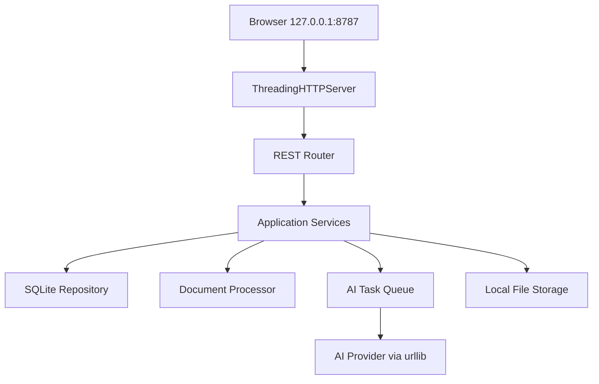

# 18. Phase 2 Supervised Interview Mini Tool — Technology Specification

## 1. Mục tiêu tài liệu

Tài liệu này chốt công nghệ, kiến trúc triển khai và các quy ước kỹ thuật cho mini tool hỗ trợ vòng phỏng vấn chuyên môn.

Tài liệu chỉ mô tả phần công nghệ. Nghiệp vụ, actor, flow phỏng vấn, tiêu chí đánh giá và phạm vi chức năng được quản lý trong Context Specification riêng.

Mục tiêu kỹ thuật:

- Triển khai nhanh trên một máy Windows client.
- Không yêu cầu cài đặt hoặc vận hành server riêng.
- Không yêu cầu Docker, Node.js, Java hoặc database server.
- Runtime backend chỉ sử dụng Python Standard Library.
- Frontend sử dụng HTML, CSS và JavaScript thuần.
- Dữ liệu được lưu local-first bằng SQLite và local filesystem.
- AI được gọi qua HTTP API nhưng không làm gián đoạn HTTP server.
- Có khả năng đóng gói thành bộ portable hoặc bộ cài Windows.

---

## 2. Technology decisions

| Thành phần | Công nghệ chốt |
| --- | --- |
| Runtime | Python 3.10+ |
| Backend | Python Standard Library |
| HTTP server | `http.server.ThreadingHTTPServer` |
| Request handler | `http.server.BaseHTTPRequestHandler` |
| Host | `127.0.0.1` |
| Port mặc định | `8787` |
| API | REST JSON, prefix `/api/v1` |
| Frontend | HTML5, CSS3, Vanilla JavaScript |
| HTTP client frontend | `fetch()` |
| JavaScript modules | Native ES Modules |
| Database | SQLite |
| Python database module | `sqlite3` |
| Database file | `clawcv.db` |
| AI HTTP client | `urllib.request` / `urllib.error` |
| Background processing | `threading` + `queue.Queue` |
| JSON | `json` |
| ID/token generation | `uuid` + `secrets` |
| Date/time | `datetime`, lưu UTC ISO 8601 |
| File/hash | `pathlib`, `hashlib`, `shutil` |
| DOCX extraction | `zipfile` + `xml.etree.ElementTree` |
| Logging | `logging` + `RotatingFileHandler` |
| Backup | SQLite Backup API + `zipfile` |
| Browser launch | `webbrowser` |
| Tests | `unittest` |
| Windows secret protection | Standard Library `ctypes` gọi Windows DPAPI |
| Deployment | Portable bundle trước; Windows installer sau |

---

## 3. Kiến trúc tổng thể

### 3.1. Kiểu kiến trúc

Kiến trúc chốt:

> Local web application dạng modular monolith, chạy trên một Python process tại máy Windows client; backend tự phục vụ frontend và REST API tại `http://127.0.0.1:8787`.

### 3.2. Sơ đồ kiến trúc



### 3.3. Runtime boundary

Ứng dụng chạy trong một process Python gồm:

- Main thread khởi tạo ứng dụng.
- `ThreadingHTTPServer` nhận request HTTP.
- Mỗi HTTP request được xử lý bởi một request thread.
- Một AI worker thread xử lý lần lượt các AI task.
- SQLite connection được tạo riêng cho từng operation/thread.

Không triển khai:

- Backend service riêng.
- Reverse proxy.
- Message broker.
- Database server.
- Container runtime.
- Network listener ngoài localhost.

---

## 4. Dependency policy

### 4.1. Runtime dependency

Application runtime chỉ được sử dụng module thuộc Python Standard Library.

Không đưa các package sau vào runtime MVP:

- Flask.
- FastAPI.
- Django.
- SQLAlchemy.
- Pydantic.
- Requests.
- aiohttp.
- PyPDF/PDF parsing package.
- Node.js/NPM package.
- Frontend framework.

### 4.2. Build-time dependency

Công cụ đóng gói Windows được phép sử dụng trong pipeline build nếu output cuối không yêu cầu máy client cài công cụ đó.

Ví dụ:

- Công cụ tạo executable/installer.
- Công cụ ký số bộ cài.
- Công cụ tạo checksum.

Các công cụ build không được trở thành runtime dependency của application.

### 4.3. Optional external executable

PDF text extraction không thuộc Python Standard Library. Nếu cần hỗ trợ PDF tự động, có thể đóng gói một executable `pdftotext` đã được phê duyệt và gọi qua `subprocess`.

Trong MVP thuần Standard Library:

- Hỗ trợ DOCX, TXT và Markdown.
- PDF sử dụng text đã được extract từ hệ thống khác hoặc cho phép người dùng paste text.
- Không tự xây PDF parser.
- PDF scan/OCR nằm ngoài phạm vi core runtime.

---

## 5. Source code structure

```text
clawcv/
├── main.py
├── app/
│   ├── config.py
│   ├── server.py
│   ├── router.py
│   ├── responses.py
│   ├── security.py
│   ├── database.py
│   ├── migrations.py
│   ├── repositories/
│   │   ├── jobs.py
│   │   ├── candidates.py
│   │   ├── interview_cases.py
│   │   ├── questions.py
│   │   ├── assessments.py
│   │   ├── ai_tasks.py
│   │   └── evaluations.py
│   ├── services/
│   │   ├── document_service.py
│   │   ├── question_service.py
│   │   ├── assessment_service.py
│   │   ├── interview_brief_service.py
│   │   ├── evaluation_service.py
│   │   ├── backup_service.py
│   │   └── audit_service.py
│   ├── ai/
│   │   ├── provider.py
│   │   ├── http_provider.py
│   │   ├── prompts.py
│   │   ├── schemas.py
│   │   └── task_worker.py
│   └── domain/
│       ├── states.py
│       ├── rules.py
│       ├── enums.py
│       └── errors.py
├── web/
│   ├── index.html
│   ├── css/
│   │   ├── base.css
│   │   ├── layout.css
│   │   └── components.css
│   ├── js/
│   │   ├── app.js
│   │   ├── api.js
│   │   ├── router.js
│   │   ├── store.js
│   │   ├── validation.js
│   │   ├── views/
│   │   └── components/
│   └── assets/
├── migrations/
│   ├── 001_initial.sql
│   └── 002_interview_workflow.sql
├── prompts/
├── tests/
└── scripts/
```

### 5.1. Layer rule

```text
HTTP Handler
→ Application Service
→ Repository / Infrastructure Adapter
→ SQLite / Filesystem / AI Provider
```

Quy tắc:

- HTTP handler không chứa SQL.
- Repository không chứa business workflow.
- Service không phụ thuộc trực tiếp vào HTTP request/response.
- AI provider không tự thay đổi workflow state.
- Frontend không truy cập trực tiếp SQLite hoặc filesystem.

---

## 6. HTTP server specification

### 6.1. Server binding

```python
ThreadingHTTPServer(("127.0.0.1", 8787), RequestHandler)
```

Không cho phép cấu hình production bind thành `0.0.0.0` trong MVP.

### 6.2. Responsibilities

HTTP server thực hiện:

- Phục vụ static frontend từ thư mục `web/`.
- Phục vụ REST API `/api/v1/*`.
- Kiểm tra method, path, header và request size.
- Tạo `request_id` cho mỗi request.
- Chuyển request đến router/controller phù hợp.
- Trả response JSON thống nhất.
- Ghi access log đã loại dữ liệu nhạy cảm.

### 6.3. Router

Router sử dụng bảng route gồm:

- HTTP method.
- Regex path.
- Handler function.
- Required access mode.
- Max body size.

Không sử dụng một khối `if/elif` lớn trong `RequestHandler`.

### 6.4. Request size limit

Giá trị mặc định:

```text
MAX_JSON_BODY = 1 MiB
MAX_UPLOAD_BODY = 10 MiB
MAX_AI_RESPONSE = 5 MiB
```

Server phải kiểm tra `Content-Length` trước khi đọc body.

### 6.5. HTTP timeout

- HTTP request nội bộ phải trả nhanh.
- Tác vụ AI không chạy đồng bộ trong request dài.
- AI request có connect/read timeout riêng.
- Frontend polling task status thay vì giữ kết nối lâu.

---

## 7. REST API convention

### 7.1. Base path

```text
/api/v1
```

### 7.2. Response envelope

Success:

```json
{
  "success": true,
  "data": {},
  "requestId": "uuid"
}
```

Error:

```json
{
  "success": false,
  "error": {
    "code": "ERROR_CODE",
    "message": "Thông báo an toàn cho người dùng"
  },
  "requestId": "uuid"
}
```

### 7.3. HTTP status

| Status | Sử dụng |
| ---: | --- |
| 200 | Read/update thành công |
| 201 | Tạo resource thành công |
| 202 | Đã tạo background task |
| 204 | Xóa/operation không có response body |
| 400 | Payload hoặc business input không hợp lệ |
| 401 | Chưa xác thực mode/session |
| 403 | Không đủ quyền hoặc sai access mode |
| 404 | Resource không tồn tại |
| 409 | State conflict hoặc duplicate operation |
| 413 | Request body quá lớn |
| 415 | Content-Type không hỗ trợ |
| 422 | Schema/field validation không đạt |
| 429 | Thao tác lặp hoặc vượt giới hạn |
| 500 | Internal error không expose chi tiết |
| 502 | AI provider lỗi |
| 504 | AI provider timeout |

### 7.4. API resources tối thiểu

```text
/api/v1/interview-cases
/api/v1/interview-cases/{id}/documents
/api/v1/interview-cases/{id}/question-set
/api/v1/interview-cases/{id}/assessment
/api/v1/assessment-attempts/{id}/answers
/api/v1/interview-cases/{id}/interview-brief
/api/v1/interview-cases/{id}/live-interview
/api/v1/interview-cases/{id}/final-evaluation
/api/v1/tasks/{id}
/api/v1/settings
/api/v1/backups
```

---

## 8. Frontend specification

### 8.1. Technology

- Semantic HTML5.
- CSS thuần, responsive.
- JavaScript ES Modules.
- `fetch()` cho REST API.
- Không dùng framework hoặc third-party UI library.
- Không cần build step cho frontend MVP.

### 8.2. Frontend module structure

```text
app.js              Application bootstrap
api.js              Fetch wrapper, timeout, error mapping
router.js           Client-side routing
store.js            In-memory UI state
validation.js       Client-side validation
views/*             Page controllers
components/*        Reusable UI components
```

### 8.3. Security rule

- Dữ liệu từ ứng viên hoặc AI được render bằng `textContent`.
- Không render raw HTML từ AI.
- Không sử dụng `eval()` hoặc `new Function()`.
- Không nhúng API key vào frontend.
- Không lưu PIN hoặc candidate token trong `localStorage` nếu không cần thiết.
- Committee API và Candidate API được backend kiểm tra quyền riêng.

### 8.4. Auto-save

- Sử dụng debounce khoảng 500–1.000 ms.
- Hiển thị `Đang lưu`, `Đã lưu`, `Lưu thất bại`.
- Trước submit phải flush thay đổi cuối cùng.
- Submit được xử lý idempotent.

### 8.5. Task polling

Frontend polling `/api/v1/tasks/{id}` theo khoảng thời gian hợp lý.

Trạng thái:

- `PENDING`.
- `RUNNING`.
- `COMPLETED`.
- `FAILED`.

Không polling vô hạn sau trạng thái terminal.

---

## 9. SQLite specification

### 9.1. Database path

```text
%LOCALAPPDATA%\ClawCV\database\clawcv.db
```

Không lưu database trong thư mục cài đặt hoặc current working directory.

### 9.2. Connection policy

- Mỗi request/repository operation mở một connection riêng.
- Không chia sẻ global connection giữa request threads.
- Không dùng `check_same_thread=False` để dùng chung một connection.
- Connection được đóng ngay sau operation/transaction.

### 9.3. PRAGMA

Khi khởi tạo database:

```sql
PRAGMA journal_mode = WAL;
PRAGMA synchronous = NORMAL;
PRAGMA foreign_keys = ON;
```

Trên mỗi connection:

```sql
PRAGMA foreign_keys = ON;
PRAGMA busy_timeout = 5000;
```

### 9.4. Query rule

- Luôn dùng parameterized query.
- Không nối string để tạo SQL từ input.
- Write operation chạy trong transaction.
- Multi-table state transition chạy trong một transaction.
- `row_factory` sử dụng `sqlite3.Row`.
- UTC timestamp lưu ISO 8601.

### 9.5. Migration

Sử dụng SQL migration có version:

```text
migrations/001_initial.sql
migrations/002_interview_workflow.sql
```

Bảng quản lý:

```sql
CREATE TABLE schema_migrations (
    version INTEGER PRIMARY KEY,
    applied_at TEXT NOT NULL
);
```

Rule:

- Migration chạy theo thứ tự.
- Mỗi migration chạy trong transaction.
- Không tiếp tục khởi động bình thường nếu migration fail.
- Backup database trước migration có rủi ro.

### 9.6. Data model technology scope

Các bảng tối thiểu:

```text
jobs
candidates
interview_cases
documents
question_sets
questions
assessment_attempts
answers
ai_tasks
ai_results
live_interview_records
evaluations
audit_logs
app_settings
schema_migrations
```

`interview_cases` là workflow center; `matches` nếu giữ lại chỉ là kết quả CV–JD, không là trung tâm flow phỏng vấn.

---

## 10. Background AI processing

### 10.1. Technology

- `queue.Queue` làm in-memory work queue.
- Một `threading.Thread` chạy AI worker.
- `ai_tasks` lưu trạng thái bền vững trong SQLite.
- Không tạo unbounded thread cho từng AI request.

### 10.2. Task lifecycle

```text
PENDING
→ RUNNING
→ COMPLETED
```

Hoặc:

```text
PENDING
→ RUNNING
→ FAILED
```

### 10.3. HTTP flow

```text
POST generate/analyze
→ Insert ai_task
→ Enqueue task
→ HTTP 202 + taskId

GET /api/v1/tasks/{taskId}
→ Current task status
```

### 10.4. Restart recovery

Khi ứng dụng khởi động:

- Task `RUNNING` từ phiên trước được chuyển sang `FAILED` hoặc `PENDING_RETRY` theo policy.
- Không giả định AI request cũ vẫn đang chạy.
- Không chạy lại task đã `COMPLETED` nếu input không thay đổi.
- Force rerun phải tạo task/result version mới.

---

## 11. AI integration specification

### 11.1. Provider abstraction

```python
class AIProvider:
    def generate_questions(self, payload):
        raise NotImplementedError

    def evaluate_answers(self, payload):
        raise NotImplementedError

    def suggest_follow_up(self, payload):
        raise NotImplementedError
```

### 11.2. HTTP implementation

`HttpAIProvider` sử dụng:

- `urllib.request.Request`.
- `urllib.request.urlopen`.
- JSON request/response.
- HTTPS endpoint.
- Explicit timeout.
- Limited retry.
- Exponential backoff.

### 11.3. Retry policy

Mặc định:

- Timeout/network error: retry tối đa 1 lần.
- HTTP 429: retry theo backoff hoặc `Retry-After` hợp lệ.
- HTTP 4xx do payload/auth: không retry tự động.
- HTTP 5xx: retry tối đa 1 lần.
- Invalid JSON/schema: retry tối đa 1 lần với repair instruction.

### 11.4. Output validation

Không sử dụng Pydantic. Validation được triển khai thủ công theo schema definition nội bộ:

- Required fields.
- Field type.
- Enum value.
- Numeric range.
- Maximum array/string size.
- Schema version.

Invalid output không được ghi thành result thành công.

### 11.5. Prompt/version

- Prompt lưu trong file versioned dưới `prompts/`.
- Mỗi AI result lưu `provider`, `model`, `prompt_key`, `prompt_version`, `schema_version`.
- Không hardcode prompt dài trong HTTP handler.
- Nội dung JD/CV/answer được bao bằng delimiter và coi là untrusted content.

### 11.6. Secrets

- API key không lưu plain text trong database, JavaScript hoặc log.
- Khi cần lưu local, sử dụng Windows DPAPI qua `ctypes`.
- Cho phép lấy secret từ environment variable trong môi trường phát triển.

---

## 12. Document processing specification

### 12.1. Supported formats

| Format | MVP support | Technology |
| --- | --- | --- |
| TXT | Có | `open()` |
| Markdown | Có | `open()` |
| DOCX | Có | `zipfile` + XML parser |
| PDF text | Không native | Paste/import extracted text hoặc optional `pdftotext` |
| PDF scan | Không | Cần OCR ngoài MVP |
| DOC legacy | Không | Không hỗ trợ binary Word format |
| DOCM | Không | Reject macro-enabled file |

### 12.2. File rule

- Validate extension và magic/signature ở mức khả thi.
- Giới hạn dung lượng.
- Tính SHA-256.
- Chuẩn hóa tên file khi lưu.
- Không dùng original filename làm directory path.
- Không thực thi macro/script.
- Không mở file bằng ứng dụng Office.
- Chỉ lưu path tương đối trong database nếu có thể.

### 12.3. Upload transport

Để tránh tự xây multipart parser phức tạp trong Standard Library MVP:

- Frontend đọc file bằng `FileReader`.
- Gửi metadata + base64 qua JSON.
- Backend giới hạn kích thước trước/sau decode.
- Không sử dụng cách này cho file lớn.

Khi cần upload lớn hoặc nhiều file, specification sau có thể bổ sung multipart parser đã được kiểm thử hoặc native file selector.

---

## 13. Localhost security

### 13.1. Network boundary

- Chỉ bind `127.0.0.1`.
- Không bind LAN/public interface.
- Không bật CORS wildcard.
- Frontend và API cùng origin.

### 13.2. Host validation

Chỉ chấp nhận Host header phù hợp với:

```text
127.0.0.1:8787
localhost:8787
```

### 13.3. Startup/CSRF token

- Tạo random token bằng `secrets.token_urlsafe()` khi khởi động.
- Mutation API yêu cầu token/session header hoặc SameSite cookie.
- Token không xuất hiện trong log.
- Token được rotate khi application restart.

### 13.4. Security headers

Server trả tối thiểu:

```text
Content-Security-Policy
X-Content-Type-Options: nosniff
X-Frame-Options: DENY
Referrer-Policy: no-referrer
Cache-Control: no-store
```

CSP chỉ cho phép resource từ `self`; `connect-src` chỉ cho phép `self` ở frontend. AI API chỉ được backend gọi.

### 13.5. Authorization modes

Backend phân tách:

- Committee session.
- Candidate attempt token.

Không chỉ ẩn chức năng bằng frontend.

Candidate token chỉ cho phép:

- Xem câu hỏi thuộc attempt.
- Lưu answer.
- Submit attempt.

Candidate token không cho phép đọc:

- CV/JD nội bộ.
- Rubric.
- AI result.
- Case khác.
- Committee API.

---

## 14. Local filesystem

### 14.1. Base directory

```text
%LOCALAPPDATA%\ClawCV\
```

### 14.2. Directory layout

```text
%LOCALAPPDATA%\ClawCV\
├── database\
│   └── clawcv.db
├── documents\
│   └── {interview-case-id}\
├── exports\
├── backups\
├── logs\
└── config\
```

### 14.3. Rule

- Dữ liệu không được lưu trong Program Files.
- Dùng UUID/case ID làm directory key.
- Chống path traversal bằng cách resolve và kiểm tra path nằm trong allowed root.
- Không lưu secret trong file config plain text.
- Không ghi nội dung CV/câu trả lời đầy đủ vào log.

---

## 15. Logging and observability

### 15.1. Technology

Sử dụng `logging` và `logging.handlers.RotatingFileHandler`.

### 15.2. Log fields

- UTC timestamp.
- Level.
- Request ID hoặc task ID.
- Module/action.
- Route/method.
- Duration.
- Error code.
- AI provider status.

### 15.3. Redaction

Không log:

- API key.
- PIN/password.
- Startup/candidate token.
- Full CV.
- Full answer.
- Raw AI payload chứa dữ liệu cá nhân.

### 15.4. Rotation

- Giới hạn kích thước log.
- Giới hạn số file backup.
- Không để log tăng không giới hạn.

---

## 16. Backup and recovery

### 16.1. SQLite backup

Sử dụng `sqlite3.Connection.backup()`.

Không copy trực tiếp `clawcv.db` trong lúc database đang ghi.

### 16.2. Backup trigger

- Người dùng thực hiện thủ công.
- Trước migration quan trọng.
- Trước xóa hồ sơ.
- Trước import/restore dữ liệu lớn.

### 16.3. Export package

Sử dụng `zipfile` để tạo package chứa:

- Metadata JSON.
- Report.
- Tài liệu được phép export.
- Hash manifest.

Export package không chứa API key, PIN hoặc internal token.

---

## 17. Application startup and shutdown

### 17.1. Startup flow

```text
Load config
→ Create local directories
→ Acquire single-instance lock
→ Initialize database
→ Apply migrations
→ Recover interrupted tasks
→ Start AI worker
→ Start ThreadingHTTPServer
→ Open default browser
```

### 17.2. Single instance

- Không cho hai instance cùng ghi một database.
- Sử dụng lock file/Windows locking hoặc port ownership check.
- Nếu instance đã chạy, chỉ mở browser đến URL hiện tại.

### 17.3. Port conflict

Port mặc định là `8787`.

Nếu port đã bị process khác sử dụng:

- Không tự đổi port âm thầm trong chế độ URL cố định.
- Hiển thị lỗi rõ và hướng dẫn xử lý.
- Có thể hỗ trợ port cấu hình ở giai đoạn sau.

### 17.4. Shutdown

- Dừng nhận AI task mới.
- Mark task chưa hoàn tất theo recovery policy.
- Gọi `server.shutdown()`.
- Đóng worker thread có kiểm soát.
- Không làm mất answer đã commit.

---

## 18. Windows deployment

### 18.1. Pilot deployment

Chốt phương án pilot: portable bundle có Python runtime đi kèm.

```text
ClawCV/
├── python/
├── app/
├── web/
├── migrations/
├── prompts/
├── start.bat
└── README.txt
```

Máy client không cần cài Python riêng.

### 18.2. Production deployment

Đóng gói thành:

```text
ClawCV-Setup.exe
```

Yêu cầu:

- Self-contained.
- Tạo shortcut.
- Không ghi dữ liệu vào thư mục cài đặt.
- Có version application.
- Có checksum.
- Ký số bộ cài nếu môi trường yêu cầu.
- Uninstall không tự động xóa dữ liệu người dùng nếu chưa xác nhận.

### 18.3. Runtime requirement

Máy client chỉ cần:

- Windows được hỗ trợ bởi đơn vị.
- Trình duyệt hiện đại.
- Quyền đọc/ghi vào `%LOCALAPPDATA%`.
- Kết nối đến AI endpoint nếu sử dụng AI remote.

---

## 19. Testing technology

### 19.1. Backend

Sử dụng `unittest` cho:

- Domain rules.
- State transitions.
- Repository.
- Migration.
- Router.
- Request validation.
- AI output validation.
- Document extraction.
- Backup/restore.

### 19.2. HTTP integration

- Khởi động server ở port test.
- Sử dụng `urllib.request` gọi API.
- Dùng temporary directory/database.
- Không gọi AI thật trong automated test; sử dụng fake provider.

### 19.3. Frontend

MVP sử dụng manual test checklist cho browser flow.

Nếu cần automated frontend test sau này, phải lập quyết định công nghệ riêng vì runtime/build hiện tại không có Node.js.

---

## 20. Performance and reliability targets

| Hạng mục | Mục tiêu |
| --- | --- |
| Server startup | Nhanh, không phụ thuộc AI provider |
| Local API | Phản hồi ngắn, không block bởi AI |
| Auto-save | Không làm gián đoạn nhập liệu |
| SQLite lock | Giảm bằng WAL, busy timeout và transaction ngắn |
| AI concurrency | Một worker mặc định |
| AI timeout | Có giới hạn, không chờ vô hạn |
| Browser refresh | Không làm mất answer đã auto-save |
| Application crash | Answer đã commit vẫn tồn tại |
| Database upgrade | Migration có version và backup |

---

## 21. Technology exclusions

Không sử dụng trong MVP:

- Flask/FastAPI/Django.
- Node.js/NPM.
- React/Vue/Angular.
- PostgreSQL/MySQL/MariaDB.
- Redis.
- Kafka.
- Docker.
- Nginx/Apache.
- WebSocket.
- Microservice.
- ORM framework.
- Cloud file storage.
- Vector database.
- Local LLM bắt buộc.
- Browser extension.
- Native desktop framework.

Việc bổ sung công nghệ bị loại phải có Architecture Decision Record riêng và chứng minh nhu cầu thực tế.

---

## 22. Coding conventions

### 22.1. Python

- Type hints cho public functions và domain objects.
- `dataclasses` cho DTO/value object phù hợp.
- Không dùng mutable global state ngoài component lifecycle được kiểm soát.
- Error code dùng constant/enum.
- Tách user-facing message khỏi raw exception.
- File/function/class có trách nhiệm rõ ràng.
- Query nằm trong repository.
- Business state transition nằm trong service/domain.

### 22.2. JavaScript

- ES Modules.
- `const`/`let`, không dùng `var`.
- Không dùng inline event handler.
- Fetch wrapper thống nhất.
- Render untrusted text bằng `textContent`.
- Không để API path rải rác trong view code.

### 22.3. SQL

- Snake case.
- Foreign key rõ ràng.
- Index cho foreign key và trường query chính.
- Timestamp UTC dạng text ISO 8601.
- Soft delete chỉ dùng khi có yêu cầu audit rõ; không áp dụng tràn lan.

---

## 23. Configuration

Các cấu hình chính:

```text
APP_HOST=127.0.0.1
APP_PORT=8787
DATA_DIRECTORY=%LOCALAPPDATA%\ClawCV
AI_PROVIDER
AI_ENDPOINT
AI_MODEL
AI_CONNECT_TIMEOUT
AI_READ_TIMEOUT
AI_MAX_RETRY
MAX_JSON_BODY
MAX_UPLOAD_BODY
LOG_LEVEL
```

Rule:

- Default an toàn được hardcode ở `config.py`.
- Secret không nằm trong file config plain text.
- Environment variable được phép override trong development.
- Production secret được lưu bằng Windows DPAPI.
- Cấu hình sai phải fail rõ, không âm thầm dùng giá trị nguy hiểm.

---

## 24. Architecture decision summary

| Quyết định | Chốt |
| --- | --- |
| Kiểu ứng dụng | Local web application |
| Process | Một Python process |
| Backend | Python Standard Library |
| HTTP | `ThreadingHTTPServer` |
| URL | `http://127.0.0.1:8787` |
| Frontend | HTML/CSS/Vanilla JavaScript |
| API | REST JSON `/api/v1` |
| Database | SQLite WAL |
| Database file | `%LOCALAPPDATA%\ClawCV\database\clawcv.db` |
| DB concurrency | Connection riêng theo operation/thread |
| AI processing | Persistent task + một background worker |
| AI HTTP | `urllib.request` |
| AI output | JSON có schema validation thủ công |
| Document core | DOCX/TXT/Markdown; PDF dùng fallback/optional extractor |
| Security | Localhost-only, Host validation, session/token, CSP |
| Secret | Windows DPAPI |
| Logging | Rotating local logs, redaction |
| Backup | SQLite Backup API + ZIP export |
| Pilot deploy | Portable bundle kèm Python runtime |
| Production deploy | Self-contained Windows installer |

---

## 25. Acceptance criteria về công nghệ

Technology implementation được xem là đạt khi:

1. Chạy trên Windows client mà không cần cài Node.js, database server hoặc Docker.
2. Frontend và REST API hoạt động tại `http://127.0.0.1:8787`.
3. Server không bind ra LAN/public interface.
4. SQLite sử dụng WAL, foreign key và busy timeout.
5. Không chia sẻ một SQLite connection toàn cục giữa request threads.
6. AI task chạy background và HTTP API trả `202` nhanh.
7. AI task/result có trạng thái bền vững trong SQLite.
8. Frontend sử dụng HTML/CSS/JavaScript thuần và `fetch()`.
9. API có prefix `/api/v1`, response envelope và error code thống nhất.
10. Candidate API và Committee API được backend phân quyền riêng.
11. API key/PIN/token không xuất hiện trong log hoặc frontend source.
12. Dữ liệu nằm dưới `%LOCALAPPDATA%\ClawCV`.
13. Migration có version và chạy transaction.
14. Backup sử dụng SQLite Backup API.
15. Có manual fallback khi AI provider lỗi.
16. Bộ portable hoặc installer không yêu cầu Python cài sẵn trên máy client.
17. Runtime application không phụ thuộc package Python bên thứ ba.

---

## 26. Kết luận

Công nghệ dự án được chốt theo hướng local-first, tối giản và dễ triển khai:

```text
Python 3.10+ Standard Library
→ ThreadingHTTPServer tại 127.0.0.1:8787
→ REST API + static frontend
→ HTML/CSS/Vanilla JavaScript
→ SQLite WAL trong clawcv.db
→ Background AI worker qua urllib
→ Local filesystem dưới %LOCALAPPDATA%\ClawCV
→ Portable bundle hoặc Windows installer
```

Kiến trúc này đáp ứng mục tiêu deploy nhanh trên máy Windows client, giảm tối đa runtime dependency và vẫn duy trì các yêu cầu quan trọng về phân lớp source, xử lý đa luồng, bảo mật localhost, migration, audit, backup và khả năng thay đổi AI provider.
