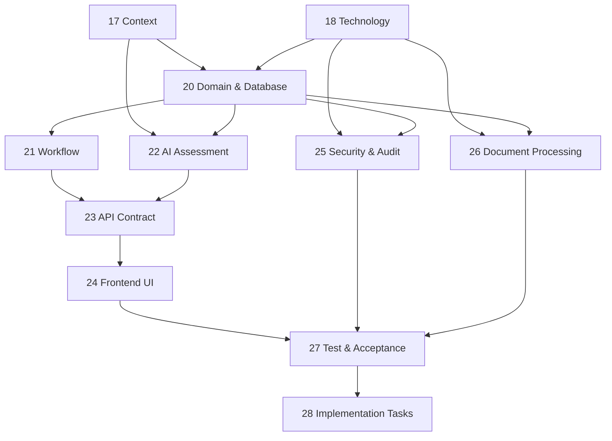

# 19. Phase 2 Supervised Interview Mini Tool — Specification Document Set Plan

## 1. Thông tin tài liệu

| Thuộc tính | Giá trị |
| --- | --- |
| Tên tài liệu | Specification Document Set Plan |
| Dự án | Phase 2 Supervised Interview Mini Tool |
| Phiên bản | 1.0 |
| Trạng thái | PROPOSED — chờ xác nhận trước khi tạo các specification chi tiết |
| Loại tài liệu | Specification governance và implementation preparation |
| Tài liệu đầu vào | Context Specification và Technology Specification |
| Đối tượng sử dụng | Product Owner, BA, HĐCM, Developer, Tester và Codex |

---

## 2. Mục tiêu tài liệu

Tài liệu này định nghĩa bộ specification hoàn chỉnh cần chuẩn bị trước khi triển khai mini tool hỗ trợ vòng phỏng vấn chuyên môn.

Tài liệu đóng vai trò:

- Bản đồ tổng thể của bộ specification.
- Danh mục tài liệu cần tạo và thứ tự ưu tiên.
- Quy định phạm vi và trách nhiệm của từng tài liệu.
- Quy định dependency giữa các specification.
- Quy định thứ tự Codex phải đọc và triển khai.
- Xác định điều kiện đủ để bắt đầu viết source code.
- Ngăn Codex tự suy đoán nghiệp vụ, công nghệ, database, API hoặc UI khi yêu cầu chưa được chốt.

Tài liệu này không thay thế Context Specification hoặc Technology Specification. Ba tài liệu nền tảng phải được đọc cùng nhau trước khi tạo các specification còn thiếu.

---

## 3. Bộ ba tài liệu đầu vào

Codex phải đọc đầy đủ ba tài liệu sau theo đúng thứ tự:

1. `17_phase2_supervised_interview_mini_tool_context_specification.md`
2. `18_phase2_supervised_interview_technology_specification.md`
3. `19_phase2_specification_document_set_plan.md`

Vai trò của từng tài liệu:

| Tài liệu | Câu hỏi được trả lời |
| --- | --- |
| Context Specification | Hệ thống giải quyết vấn đề gì, phục vụ ai, flow nghiệp vụ và phạm vi MVP là gì? |
| Technology Specification | Hệ thống được xây dựng bằng công nghệ nào và có những ràng buộc kỹ thuật nào? |
| Specification Document Set Plan | Còn phải chốt những tài liệu nào trước khi Codex triển khai source code? |

Nếu ba tài liệu có nội dung chưa thống nhất, Codex không được tự chọn một phương án. Codex phải ghi nhận conflict và yêu cầu người phụ trách xác nhận.

---

## 4. Nguyên tắc xây dựng bộ specification

### 4.1. Một nội dung có một nguồn sự thật chính

Mỗi nhóm quyết định chỉ có một tài liệu chịu trách nhiệm chính:

| Nhóm quyết định | Tài liệu chịu trách nhiệm chính |
| --- | --- |
| Mục tiêu, scope, actor, nghiệp vụ | Context Specification |
| Runtime, framework, dependency, deployment | Technology Specification |
| Entity, field, relationship, constraint | Domain and Database Specification |
| Trạng thái và chuyển trạng thái | Workflow State Machine |
| Endpoint, request, response, error | API Contract Specification |
| Prompt, rubric, AI input/output | AI Assessment Specification |
| Screen, component, interaction | Frontend UI Specification |
| Bảo mật, privacy, audit | Security and Audit Specification |
| Upload và trích xuất tài liệu | Document Processing Specification |
| Testcase và tiêu chí nghiệm thu | Test and Acceptance Specification |
| Thứ tự phát triển và task | Implementation Task Breakdown |

Các tài liệu khác chỉ tham chiếu, không lặp lại toàn bộ nội dung thuộc nguồn sự thật chính.

### 4.2. Không mở rộng ngoài MVP

Mọi specification chi tiết phải bám theo phạm vi MVP đã chốt trong Context Specification.

Không tự bổ sung:

- Hệ thống tài khoản doanh nghiệp phức tạp.
- Server triển khai tập trung.
- Microservice.
- Docker runtime.
- Node.js frontend build pipeline.
- Cloud database.
- Tích hợp AMIS hoặc Recruitment Core trong MVP.
- Tự động đưa ra quyết định tuyển dụng cuối cùng.
- Giám sát ứng viên bằng webcam, microphone hoặc biometric.

### 4.3. Ưu tiên khả năng triển khai trên Windows client

Mọi thiết kế phải giữ đúng các ràng buộc:

- Chạy local trên máy Windows của HĐCM.
- Backend Python 3.10+ Standard Library.
- `ThreadingHTTPServer` tại `127.0.0.1:8787`.
- HTML, CSS và Vanilla JavaScript.
- SQLite local trong `clawcv.db`.
- Không yêu cầu Python được cài sẵn khi bàn giao bản portable hoặc installer.

### 4.4. AI là công cụ hỗ trợ

- AI tạo đề xuất, không thay HĐCM quyết định.
- Mọi kết quả AI phải cho phép HĐCM xem xét và chỉnh sửa.
- Kết quả AI phải có bằng chứng hoặc căn cứ từ dữ liệu đầu vào.
- Khi AI lỗi, workflow phải có manual fallback.

### 4.5. Specification trước, implementation sau

Codex chưa được triển khai chức năng nghiệp vụ khi các specification bắt buộc liên quan chưa đạt trạng thái `APPROVED`.

Codex có thể tạo skeleton repository sau khi Technology Specification được duyệt, nhưng không được tự chốt database, endpoint, scoring hoặc UI behavior còn thiếu.

---

## 5. Cấu trúc bộ tài liệu mục tiêu

```text
project-root/
├── AGENTS.md
├── README.md
├── specifications/
│   ├── 17_phase2_supervised_interview_mini_tool_context_specification.md
│   ├── 18_phase2_supervised_interview_technology_specification.md
│   ├── 19_phase2_specification_document_set_plan.md
│   ├── 20_domain_and_database_specification.md
│   ├── 21_workflow_state_machine.md
│   ├── 22_ai_assessment_specification.md
│   ├── 23_api_contract_specification.md
│   ├── 24_frontend_ui_specification.md
│   ├── 25_security_and_audit_specification.md
│   ├── 26_document_processing_specification.md
│   ├── 27_test_and_acceptance_specification.md
│   └── 28_implementation_task_breakdown.md
├── prompts/
│   ├── question_generation_prompt.md
│   ├── answer_evaluation_prompt.md
│   └── follow_up_question_prompt.md
└── schemas/
    ├── question_generation.schema.json
    ├── answer_evaluation.schema.json
    └── follow_up_question.schema.json
```

Không bắt buộc tạo toàn bộ source directory trước khi hoàn thành specification. Cấu trúc source chính thức được lấy theo Technology Specification.

---

## 6. Danh mục specification cần tạo

> Thứ tự triển khai chính thức của bộ tài liệu là `20 → 21 → 22 AI Assessment → 23 API Contract → 24 → 25 → 26 → 27 → 28`. Tên file và thứ tự trong Section 10/Section 19 là nguồn tham chiếu chính khi có khác biệt về cách trình bày catalog.

### 6.1. `20_domain_and_database_specification.md`

#### Mức độ

`BẮT BUỘC — ƯU TIÊN 1`

#### Mục tiêu

Chốt domain model và schema SQLite làm nền tảng cho API, workflow, AI result, UI và migration.

#### Nội dung tối thiểu

- Domain boundary.
- Entity list.
- Trách nhiệm của từng entity.
- Field, data type, nullability và default value.
- Primary key và foreign key.
- Relationship và cardinality.
- Enum và status field.
- Unique constraint.
- Index.
- Timestamp convention.
- JSON field convention.
- Quy tắc lưu file và đường dẫn tương đối.
- Data ownership.
- Data lifecycle.
- Quy tắc soft delete hoặc hard delete.
- Migration version đầu tiên.
- SQLite DDL đề xuất.
- ER diagram.
- Dữ liệu seed tối thiểu.
- Conflict và assumption.

#### Entity tối thiểu cần xem xét

- `Job`
- `Candidate`
- `InterviewCase`
- `Document`
- `QuestionSet`
- `Question`
- `AssessmentAttempt`
- `Answer`
- `AiTask`
- `AiResult`
- `InterviewBrief`
- `LiveInterviewRecord`
- `Evaluation`
- `AuditLog`
- `AppSetting`
- `SchemaMigration`

#### Điều kiện hoàn thành

- Mỗi bảng có field và constraint rõ ràng.
- Có quan hệ đầy đủ giữa Interview Case và dữ liệu liên quan.
- Có thể viết migration mà không cần Codex tự thêm field nghiệp vụ.
- Không phụ thuộc ORM.

---

### 6.2. `21_workflow_state_machine.md`

#### Mức độ

`BẮT BUỘC — ƯU TIÊN 2`

#### Mục tiêu

Chốt toàn bộ trạng thái của Interview Case, Assessment Attempt và AI Task.

#### Nội dung tối thiểu

- State groups.
- Danh sách state và định nghĩa.
- State diagram.
- Transition table.
- Actor được phép thực hiện transition.
- Precondition và postcondition.
- Side effect.
- Invalid transition.
- Error state.
- Retry và recovery.
- Idempotency.
- State ownership theo module.
- Audit event tương ứng.
- Quy tắc khóa dữ liệu sau khi submit.
- Quy tắc resume sau khi ứng dụng restart.

#### Điều kiện hoàn thành

- Mọi action trong Context Specification đều ánh xạ được vào transition.
- Không có transition mơ hồ.
- API có thể validate trạng thái bằng rule xác định.

---

### 6.3. `23_api_contract_specification.md`

#### Mức độ

`BẮT BUỘC — ƯU TIÊN 4`

#### Dependency

- Domain and Database Specification.
- Workflow State Machine.
- AI Assessment Specification cho các endpoint AI.

#### Mục tiêu

Chốt hợp đồng giữa Vanilla JavaScript frontend và Python backend.

#### Nội dung tối thiểu

- API convention.
- Base path `/api/v1`.
- Content type.
- Success envelope.
- Error envelope.
- Common error code.
- Request ID.
- Date/time format.
- Pagination, filtering và sorting nếu có.
- Endpoint list theo resource.
- Request path, query, header và body.
- Response body.
- Validation rule.
- Authorization mode.
- State transition.
- Audit event.
- Idempotency.
- HTTP status.
- File upload protocol.
- AI task polling protocol.
- Candidate Mode API boundary.
- Committee Mode API boundary.

#### Nhóm API tối thiểu

- Health và application status.
- Jobs.
- Candidates.
- Interview cases.
- Documents.
- Question sets và questions.
- Assessment sessions và answers.
- AI tasks và AI results.
- Interview brief.
- Live interview record.
- Final evaluation.
- Settings.
- Backup và export.

#### Điều kiện hoàn thành

- Frontend có thể triển khai mà không tự đoán payload.
- Backend có thể triển khai mà không tự đoán validation hoặc error code.
- Mỗi mutation endpoint xác định rõ transition và audit event.

---

### 6.4. `22_ai_assessment_specification.md`

#### Mức độ

`BẮT BUỘC — ƯU TIÊN 3`

#### Mục tiêu

Chốt nguyên tắc, input, output, prompt, rubric và failure handling cho toàn bộ chức năng AI.

#### AI capability bắt buộc

1. Phân tích JD và CV để sinh bộ câu hỏi.
2. Đánh giá câu trả lời của ứng viên.
3. Tạo Interview Brief và gợi ý câu hỏi phỏng vấn trực tiếp.

#### Nội dung tối thiểu

- Trigger.
- Input contract.
- Output contract.
- Prompt contract.
- Prompt version.
- JSON Schema.
- Scoring dimensions.
- Weight và scoring range.
- Rubric theo mức điểm.
- Evidence requirement.
- Confidence.
- Strengths.
- Concerns.
- Contradictions.
- Missing evidence.
- Follow-up questions.
- Output validation.
- Retry.
- Timeout.
- Manual fallback.
- Rerun rule.
- Idempotency.
- Human review.
- Audit.
- Privacy và data minimization.
- Prompt injection protection.
- Quy định AI không ra quyết định tuyển dụng cuối cùng.

#### Supporting artifact

- `prompts/question_generation_prompt.md`
- `prompts/answer_evaluation_prompt.md`
- `prompts/follow_up_question_prompt.md`
- Ba JSON Schema tương ứng trong `schemas/`.

#### Điều kiện hoàn thành

- Mỗi AI call có input/output xác định.
- Output parse được bằng `json` trong Python Standard Library.
- Có quy tắc xử lý khi output không đúng schema.
- Có rubric đủ rõ để HĐCM kiểm tra kết quả.

---

### 6.5. `24_frontend_ui_specification.md`

#### Mức độ

`BẮT BUỘC — ƯU TIÊN 5`

#### Dependency

- Context Specification.
- Workflow State Machine.
- API Contract Specification.

#### Mục tiêu

Chốt route, screen, component, field, action và UI state của ứng dụng.

#### Screen tối thiểu

1. Interview Case List.
2. Create/Edit Interview Case.
3. Import JD và CV.
4. Document Processing Result.
5. Question Generation Status.
6. Question Review and Approval.
7. Candidate Check-in.
8. Candidate Assessment.
9. Assessment Submitted/Waiting.
10. AI Evaluation Result.
11. Interview Brief.
12. Live Interview Workspace.
13. Final Evaluation.
14. AI Settings.
15. Backup/Restore.

#### Nội dung tối thiểu cho mỗi screen

- Mục tiêu.
- Actor.
- Route.
- Entry condition.
- Data dependency.
- Component list.
- Field và validation.
- Button/action.
- API dependency.
- Loading state.
- Empty state.
- Error state.
- Disabled/locked state.
- Confirmation dialog.
- Success feedback.
- Responsive behavior.
- Accessibility cơ bản.

#### Quy tắc bắt buộc

- Tách rõ Committee Mode và Candidate Mode.
- Candidate Mode không được hiển thị CV, AI evaluation, expected answer hoặc dữ liệu nội bộ HĐCM.
- Không dùng `innerHTML` với dữ liệu không tin cậy.
- Câu trả lời phải autosave.
- Submit phải có xác nhận và khóa bài.

#### Điều kiện hoàn thành

- Mỗi bước nghiệp vụ có màn hình hoặc action tương ứng.
- Mỗi màn hình xác định được API cần gọi.
- Codex không phải tự thiết kế flow UI.

---

### 6.6. `25_security_and_audit_specification.md`

#### Mức độ

`BẮT BUỘC TRƯỚC PILOT — ƯU TIÊN 6`

#### Mục tiêu

Chốt kiểm soát bảo mật, privacy và audit cho dữ liệu tuyển dụng lưu trên máy local.

#### Nội dung tối thiểu

- Security principles.
- Trust boundary.
- Localhost network boundary.
- Host header validation.
- Committee authentication/PIN/session.
- Candidate session token.
- CSRF/startup token.
- Role/capability matrix.
- Candidate API isolation.
- File upload security.
- Path traversal protection.
- Content Security Policy.
- Security headers.
- Output encoding.
- Sensitive data redaction.
- API key protection.
- AI data policy.
- PII lifecycle.
- Backup protection.
- Audit event catalog.
- Audit record schema.
- Log retention.
- Security error response.
- Threats và mitigation cho phạm vi MVP.

#### Điều kiện hoàn thành

- Có ma trận quyền Candidate/Committee/System.
- Có danh sách audit event bắt buộc.
- Không để CV, câu trả lời, token hoặc API key xuất hiện trong log.

---

### 6.7. `26_document_processing_specification.md`

#### Mức độ

`BẮT BUỘC TRƯỚC CHỨC NĂNG IMPORT — ƯU TIÊN 7`

#### Mục tiêu

Chốt cách tiếp nhận, lưu trữ và trích xuất nội dung JD/CV trong giới hạn Python Standard Library.

#### Nội dung tối thiểu

- Supported format.
- Unsupported format.
- Maximum file size.
- Filename normalization.
- MIME/extension validation.
- Hash.
- Relative storage path.
- Original file và extracted text.
- TXT/MD decoding.
- DOCX extraction bằng `zipfile` và XML.
- PDF limitation.
- Optional `pdftotext` adapter.
- Manual paste fallback.
- Unicode normalization.
- Text length limit.
- Error handling.
- Retry.
- Document versioning.
- Audit event.
- Cleanup rule.

#### Điều kiện hoàn thành

- Nêu rõ PDF không được parse tin cậy chỉ bằng Standard Library.
- Có fallback khi không trích xuất được nội dung.
- Không để filename người dùng quyết định đường dẫn lưu thực tế.

---

### 6.8. `27_test_and_acceptance_specification.md`

#### Mức độ

`BẮT BUỘC — ƯU TIÊN 8`

#### Dependency

Tất cả specification chức năng và kỹ thuật phía trên.

#### Mục tiêu

Chốt điều kiện nghiệm thu và bộ test tối thiểu để Codex tự kiểm tra sau mỗi batch.

#### Nội dung tối thiểu

- Test strategy.
- Test level.
- Test environment.
- Test data.
- Functional testcase.
- API testcase.
- Database testcase.
- Workflow transition testcase.
- AI mock testcase.
- File processing testcase.
- Security testcase.
- Candidate Mode isolation testcase.
- Autosave và submit testcase.
- Restart recovery testcase.
- Backup/restore testcase.
- Performance testcase.
- Windows smoke test.
- Manual acceptance test.
- Regression checklist.
- Exit criteria.

#### Testcase format

```text
ID
Requirement reference
Priority
Precondition
Input/Test data
Steps
Expected result
Automated/Manual
Evidence
```

#### Điều kiện hoàn thành

- Mỗi acceptance criterion trong Context và Technology Specification có testcase tương ứng.
- Có test cho happy path, invalid input, failure và recovery.
- Có thể chạy backend test bằng `python -m unittest`.

---

### 6.9. `28_implementation_task_breakdown.md`

#### Mức độ

`BẮT BUỘC TRƯỚC KHI CODEX IMPLEMENT TOÀN BỘ — ƯU TIÊN 9`

#### Dependency

Toàn bộ specification từ 20 đến 27.

#### Mục tiêu

Chia implementation thành các batch nhỏ, kiểm thử được và hạn chế Codex thay đổi quá nhiều phạm vi trong một lần.

#### Batch đề xuất

| Batch | Phạm vi chính |
| --- | --- |
| A | Project bootstrap, config, HTTP server và static frontend |
| B | SQLite connection, migration và repository foundation |
| C | Job, Candidate, Interview Case và Document |
| D | Question Set, Question và Committee review |
| E | Candidate Mode, assessment, autosave và submit |
| F | AI provider, persistent task queue và recovery |
| G | Answer evaluation và Interview Brief |
| H | Live Interview Record và Final Evaluation |
| I | Security, audit, backup và restore |
| J | Test, packaging và Windows pilot release |

#### Nội dung mỗi task

- Task ID.
- Mục tiêu.
- Specification reference.
- Dependency.
- File được tạo/sửa.
- File không được sửa.
- Implementation note.
- Test cần chạy.
- Acceptance criteria.
- Definition of Done.
- Risk.

#### Điều kiện hoàn thành

- Không có task quá lớn hoặc chứa nhiều module độc lập.
- Mỗi batch có checkpoint chạy được.
- Mỗi task truy vết được về specification và testcase.

---

## 7. Các file điều khiển Codex

### 7.1. `AGENTS.md`

`AGENTS.md` được tạo sau khi các specification chính đã chốt và đặt tại project root.

Nội dung tối thiểu:

- Project scope.
- Runtime constraint.
- Dependency policy.
- Source structure.
- Layer rule.
- Coding convention.
- Database migration rule.
- Security rule.
- Logging restriction.
- Test command.
- Run command.
- Build/package command.
- Do-not-touch list.
- Specification priority.
- Definition of Done.

Quy tắc cốt lõi:

```text
Không thêm framework hoặc dependency runtime bên thứ ba.
Không tự thay đổi nghiệp vụ đã chốt.
Không tự sửa specification để hợp thức hóa implementation.
Không bỏ qua migration.
Không log PII, câu trả lời, token hoặc API key.
Không đánh dấu hoàn thành nếu chưa chạy test liên quan.
```

### 7.2. `README.md`

README được cập nhật dần trong quá trình triển khai và hoàn thiện trước pilot.

Nội dung tối thiểu:

- Giới thiệu ứng dụng.
- Phạm vi MVP.
- Yêu cầu Windows.
- Cách chạy development.
- Cách chạy test.
- Cách cấu hình AI.
- Cách mở ứng dụng.
- Cách backup/restore.
- Cách đóng gói portable/installer.
- Known limitations.
- Troubleshooting cơ bản.

---

## 8. Metadata chuẩn cho mỗi specification

Mỗi specification mới phải có phần metadata ở đầu tài liệu:

```md
## Thông tin tài liệu

| Thuộc tính | Giá trị |
| --- | --- |
| Phiên bản | 1.0 |
| Trạng thái | DRAFT / REVIEWED / APPROVED / SUPERSEDED |
| Owner | ... |
| Last updated | YYYY-MM-DD |
| Depends on | ... |
| Supersedes | ... |
```

Ý nghĩa trạng thái:

| Trạng thái | Ý nghĩa |
| --- | --- |
| `DRAFT` | Đang xây dựng, chưa được dùng để implement chính thức |
| `REVIEWED` | Đã được rà soát nhưng còn điểm cần xác nhận |
| `APPROVED` | Được phép dùng làm nguồn triển khai |
| `SUPERSEDED` | Đã được thay thế bởi tài liệu hoặc phiên bản khác |

---

## 9. Quy tắc truy vết yêu cầu

Mỗi yêu cầu quan trọng phải có mã định danh.

Prefix đề xuất:

| Prefix | Nhóm yêu cầu |
| --- | --- |
| `CTX` | Context và nghiệp vụ |
| `TECH` | Công nghệ và kiến trúc |
| `DATA` | Domain và database |
| `WF` | Workflow |
| `API` | API |
| `AI` | AI |
| `UI` | Frontend UI |
| `SEC` | Security và audit |
| `DOC` | Document processing |
| `TEST` | Test và acceptance |
| `TASK` | Implementation task |

Ví dụ:

```text
CTX-ASS-001: Ứng viên phải làm bài tại địa điểm phỏng vấn.
WF-ATT-004: Bài đã submit không được chỉnh sửa.
API-ANS-003: Save answer phải hỗ trợ retry an toàn.
SEC-CAND-002: Candidate Mode không được truy cập AI result.
TEST-CAND-006: Xác minh Candidate Mode không đọc được Committee API.
```

Task triển khai phải tham chiếu requirement ID và testcase phải tham chiếu requirement tương ứng.

---

## 10. Thứ tự tạo specification



Thứ tự thực hiện đề xuất:

1. Domain and Database Specification.
2. Workflow State Machine.
3. AI Assessment Specification.
4. API Contract Specification.
5. Frontend UI Specification.
6. Security and Audit Specification.
7. Document Processing Specification.
8. Test and Acceptance Specification.
9. Implementation Task Breakdown.
10. `AGENTS.md`.
11. Khởi tạo và triển khai source code theo từng batch.

Security và Document Processing có thể được soạn song song sau khi Domain and Database đã ổn định, nhưng phải hoàn thành trước khi viết các chức năng tương ứng.

---

## 11. Milestone chuẩn bị dự án

### Milestone S0 — Foundation Approved

Tài liệu bắt buộc:

- Context Specification.
- Technology Specification.
- Specification Document Set Plan.

Kết quả:

- Scope và công nghệ đã rõ.
- Có kế hoạch tạo bộ specification.
- Chưa bắt đầu implementation nghiệp vụ.

### Milestone S1 — Core Design Approved

Tài liệu bắt buộc:

- Domain and Database Specification.
- Workflow State Machine.
- AI Assessment Specification.

Kết quả:

- Dữ liệu, trạng thái và AI contract được chốt.

### Milestone S2 — Interface Design Approved

Tài liệu bắt buộc:

- API Contract Specification.
- Frontend UI Specification.
- Security and Audit Specification.
- Document Processing Specification.

Kết quả:

- Backend/frontend boundary và security boundary được chốt.

### Milestone S3 — Implementation Ready

Tài liệu bắt buộc:

- Test and Acceptance Specification.
- Implementation Task Breakdown.
- `AGENTS.md`.

Kết quả:

- Codex được phép bắt đầu triển khai theo batch.

---

## 12. Quy trình Codex phải thực hiện

### 12.1. Khi được yêu cầu tạo specification còn thiếu

Codex phải:

1. Đọc ba tài liệu nền tảng.
2. Đọc tất cả specification đã được tạo trước đó có dependency trực tiếp.
3. Xác định conflict, assumption và open question.
4. Không tự thay đổi quyết định đã chốt.
5. Tạo đúng một specification theo thứ tự ưu tiên, trừ khi người dùng yêu cầu nhiều file.
6. Kiểm tra tham chiếu chéo với các tài liệu đã có.
7. Đánh dấu trạng thái tài liệu là `DRAFT` nếu chưa được người phụ trách duyệt.
8. Bàn giao file Markdown để review.

### 12.2. Khi được yêu cầu triển khai source code

Codex phải:

1. Đọc `AGENTS.md`.
2. Đọc Implementation Task Breakdown.
3. Đọc specification được task tham chiếu.
4. Kiểm tra trạng thái specification.
5. Chỉ triển khai phạm vi của task/batch hiện tại.
6. Không tự thêm dependency runtime.
7. Viết hoặc cập nhật test.
8. Chạy test liên quan.
9. Báo cáo file đã thay đổi, test result và phần chưa hoàn thành.

### 12.3. Khi phát hiện thiếu thông tin

Codex được phép đưa ra `ASSUMPTION` chỉ khi:

- Assumption không thay đổi scope.
- Assumption không ảnh hưởng bảo mật hoặc dữ liệu.
- Assumption có thể thay đổi dễ dàng.
- Assumption được ghi rõ trong tài liệu hoặc báo cáo triển khai.

Codex phải dừng và hỏi khi thiếu thông tin liên quan đến:

- Quyết định tuyển dụng.
- Scoring/rubric.
- Quyền truy cập dữ liệu.
- Dữ liệu gửi ra AI provider.
- Xóa hoặc ghi đè dữ liệu.
- State transition nghiệp vụ.
- Thay đổi công nghệ đã chốt.

---

## 13. Thứ tự ưu tiên khi có conflict

Nếu có conflict, áp dụng nguyên tắc sau:

1. Quyết định mới nhất được người phụ trách xác nhận bằng văn bản.
2. Context Specification đối với scope và nghiệp vụ.
3. Technology Specification đối với công nghệ và dependency.
4. Domain and Database Specification đối với dữ liệu.
5. Workflow State Machine đối với trạng thái.
6. AI Assessment Specification đối với AI behavior và scoring.
7. API Contract Specification đối với giao tiếp frontend/backend.
8. Security and Audit Specification đối với kiểm soát bảo mật.
9. Document Processing Specification đối với file processing.
10. Frontend UI Specification đối với screen và interaction.
11. Test and Acceptance Specification đối với cách xác minh.
12. Implementation Task Breakdown đối với trình tự thực hiện.
13. README chỉ mang tính hướng dẫn sử dụng và không được ghi đè specification.

Không được giải quyết conflict bằng cách âm thầm sửa một tài liệu.

---

## 14. Tài liệu Phase 1 được sử dụng như thế nào

Các specification của Recruitment Phase 1 chỉ được dùng làm tài liệu tham khảo về:

- Cấu trúc trình bày.
- Cách mô tả domain model.
- Cách mô tả workflow.
- Cách mô tả API contract.
- Cách mô tả AI contract.
- Cách chia implementation task.
- Cách xây dựng security và audit rule.

Không được sao chép trực tiếp các quyết định sau từ Phase 1 sang mini tool:

- NestJS.
- PostgreSQL.
- Docker runtime.
- Kiến trúc server tập trung.
- Module đăng tin đa kênh.
- Bot chăm sóc ứng viên.
- AMIS integration.
- Recruitment Core integration.
- Form pre-screening từ xa.
- HR Review workflow của Phase 1.
- Auth hoặc role model của hệ thống Phase 1.

Mini tool là ứng dụng độc lập, local-first và có workflow riêng tại địa điểm phỏng vấn.

---

## 15. Definition of Ready để bắt đầu implementation

Dự án được coi là sẵn sàng cho Codex triển khai khi:

1. Context Specification ở trạng thái `APPROVED`.
2. Technology Specification ở trạng thái `APPROVED`.
3. Domain and Database Specification đã chốt field và constraint.
4. Workflow State Machine không còn transition mơ hồ.
5. AI Assessment Specification đã chốt rubric và output schema.
6. API Contract đủ request/response/error cho batch cần triển khai.
7. Frontend UI Specification đủ screen và state cho batch cần triển khai.
8. Security rule liên quan đã được xác định.
9. Testcase và acceptance criteria cho batch đã có.
10. Implementation task có phạm vi và Definition of Done rõ ràng.
11. `AGENTS.md` đã được tạo.
12. Không còn open question mức `BLOCKER`.

Có thể bắt đầu theo từng batch khi tài liệu liên quan đến batch đó đã sẵn sàng; không bắt buộc chờ toàn bộ tính năng tương lai ngoài MVP.

---

## 16. Definition of Done cho một specification

Một specification được coi là hoàn thành khi:

- Có mục tiêu và phạm vi rõ ràng.
- Có dependency và tài liệu tham chiếu.
- Không mâu thuẫn với Context và Technology Specification.
- Mọi thuật ngữ quan trọng được định nghĩa.
- Có rule đủ cụ thể để triển khai.
- Có error/failure handling.
- Có security consideration phù hợp.
- Có acceptance criteria.
- Có Conflict/Assumption/Open Question.
- Có requirement ID cho yêu cầu quan trọng.
- Không chứa `TODO` không có owner hoặc hướng xử lý.
- Được người phụ trách chuyển trạng thái sang `APPROVED`.

---

## 17. Ma trận mức độ cần thiết

| Tài liệu | Trước khi tạo source | Trước khi làm tính năng liên quan | Trước pilot |
| --- | --- | --- | --- |
| Context Specification | Bắt buộc | Bắt buộc | Bắt buộc |
| Technology Specification | Bắt buộc | Bắt buộc | Bắt buộc |
| Document Set Plan | Bắt buộc | Tham chiếu | Tham chiếu |
| Domain and Database | Bắt buộc | Bắt buộc | Bắt buộc |
| Workflow State Machine | Bắt buộc | Bắt buộc | Bắt buộc |
| AI Assessment | Có thể hoàn thiện sau skeleton | Bắt buộc trước AI | Bắt buộc |
| API Contract | Có thể hoàn thiện theo batch | Bắt buộc | Bắt buộc |
| Frontend UI | Có thể hoàn thiện theo batch | Bắt buộc | Bắt buộc |
| Security and Audit | Có thể hoàn thiện theo batch | Bắt buộc với dữ liệu thật | Bắt buộc |
| Document Processing | Không cần cho skeleton | Bắt buộc trước import | Bắt buộc |
| Test and Acceptance | Không cần cho skeleton | Bắt buộc theo batch | Bắt buộc |
| Implementation Tasks | Bắt buộc trước implementation chính | Bắt buộc | Bắt buộc |
| AGENTS.md | Bắt buộc trước implementation chính | Bắt buộc | Bắt buộc |
| README.md | Có thể tạo bản khung | Cập nhật dần | Bắt buộc |

---

## 18. Open questions cần xác nhận trong các specification tiếp theo

Các câu hỏi dưới đây không chặn việc tạo Domain and Database Specification, nhưng phải được xử lý tại tài liệu phù hợp:

1. Rubric đánh giá dùng chung hay cấu hình riêng theo từng vị trí?
2. Số lượng câu hỏi mặc định và thời lượng làm bài mặc định?
3. HĐCM có được sửa câu hỏi sau khi ứng viên đã check-in không?
4. Khi ứng viên chưa trả lời hết, hệ thống cho submit hay bắt buộc hoàn thành?
5. Có cho phép HĐCM mở lại bài đã submit không?
6. AI result có được rerun sau khi HĐCM chỉnh câu trả lời hoặc rubric không?
7. Dữ liệu ứng viên được lưu trong bao lâu?
8. Backup có chứa API key hay không?
9. PDF được hỗ trợ bằng `pdftotext` trong pilot hay chỉ dùng paste text?
10. Committee Mode sử dụng PIN local hay startup token là đủ?
11. Có cần export kết quả sang PDF/HTML hay chỉ xem trên ứng dụng?
12. Một Interview Case có một hay nhiều thành viên HĐCM cùng đánh giá?

Mỗi câu hỏi phải được chuyển thành một trong các kết quả:

- Quyết định đã chốt.
- Assumption được chấp nhận cho MVP.
- Ngoài phạm vi MVP.
- Backlog sau MVP.

---

## 19. Kế hoạch hành động tiếp theo

Sau khi tài liệu này được xác nhận, tạo lần lượt:

1. `20_domain_and_database_specification.md`.
2. `21_workflow_state_machine.md`.
3. `22_ai_assessment_specification.md`.
4. `23_api_contract_specification.md`.
5. `24_frontend_ui_specification.md`.
6. `25_security_and_audit_specification.md`.
7. `26_document_processing_specification.md`.
8. `27_test_and_acceptance_specification.md`.
9. `28_implementation_task_breakdown.md`.
10. `AGENTS.md`.
11. Khởi tạo source code và triển khai Batch A.

Mỗi specification được tạo và review riêng. Không nên yêu cầu Codex tạo toàn bộ specification và source code trong cùng một lần thực hiện.

---

## 20. Acceptance criteria của tài liệu này

Tài liệu này đạt yêu cầu khi:

1. Xác định đầy đủ bộ specification của MVP.
2. Mỗi tài liệu có mục tiêu, nội dung tối thiểu và điều kiện hoàn thành.
3. Có thứ tự tạo và dependency rõ ràng.
4. Có quy tắc để Codex đọc, tạo tài liệu và triển khai source code.
5. Có Definition of Ready và Definition of Done.
6. Có quy tắc xử lý conflict.
7. Phân biệt rõ tài liệu Phase 1 chỉ là nguồn tham khảo.
8. Không thay đổi công nghệ đã chốt.
9. Không mở rộng ngoài phạm vi mini tool MVP.

---

## 21. Kết luận

Bộ ba tài liệu nền tảng của dự án gồm:

```text
Context Specification
+ Technology Specification
+ Specification Document Set Plan
```

Ba tài liệu này cung cấp đủ bối cảnh để Codex tiếp tục tạo lần lượt các specification chi tiết còn thiếu.

Tài liệu cần tạo tiếp theo là:

```text
20_domain_and_database_specification.md
```

Sau khi hoàn thiện các specification bắt buộc và `AGENTS.md`, Codex mới bắt đầu triển khai source code theo từng batch trong Implementation Task Breakdown.
